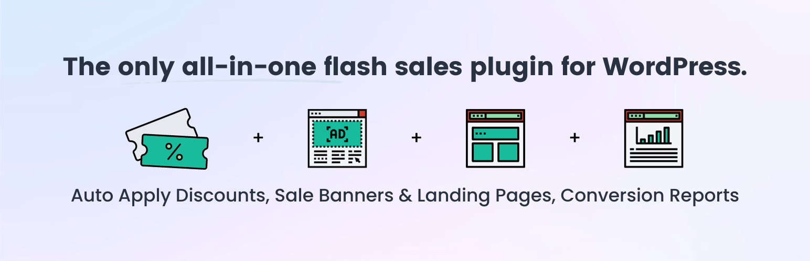

# [Sitewide Sales](https://sitewidesales.com) #

### Welcome to the Sitewide Sales GitHub Repository
Sitewide Sales allows you to run Black Friday, Cyber Monday, or other flash sales on your WordPress-powered eCommerce or membership site.

This plugin offers modules for [WooCommerce](https://sitewidesales.com/modules/woocommerce/), [Paid Memberships Pro](https://sitewidesales.com/modules/paid-memberships-pro/), and [Easy Digital Downloads](https://sitewidesales.com/modules/easy-digital-downloads/). You can also use the [Custom sale module](https://sitewidesales.com/modules/custom-module/) to track any banner > landing page > conversion workflow. New integrations will be built as requested.

Let Sitewide Sales handle your sale banners, notification bars, landing pages, and reporting. Running a sale like this used to require three or more separate plugins. Now you can run your sale with a single tool. At the same time, the Sitewide Sales plugin is flexible enough that you can use specific banner and landing page plugins if wanted.

For more information please visit [the Sitewide Sales website](https://sitewidesales.com) or [browse Sale Landing Page and Banner demos](https://sitewidesales.com/demos/).

## Installation ##
For detailed installation steps, visit the [documentation on getting started with the plugin](https://sitewidesales.com/documentation/).

1. Download the current development ZIP file directly: `https://github.com/strangerstudios/sitewide-sales/archive/dev.zip`

**Please ensure that once installing this version of the plugin to remove `-dev` from the plugin's folder name.**

## Bugs ##
If you find an issue/bug, let us know by [creating a detailed GitHub issue](https://github.com/strangerstudios/sitewide-sales/issues/new/choose).

## Support ##
This is a developer's portal for Sitewide Sales. We do not offer support on this channel. **Any support related questions should be directed to [strangerstudios.com](https://www.strangerstudios.com).**

## Contributing to Sitewide Sales ##
We encourage and welcome any contribution to Sitewide Sales. Please read the [guidelines for contributing](https://github.com/strangerstudios/sitewide-sales/blob/dev/.github/CONTRIBUTING.md) to this repository.

There are various **ways to help the development** of Sitewide Sales:

1. Report [bugs/issues](https://github.com/strangerstudios/sitewide-sales/issues/new/choose) on GitHub.
2. Work on any issues by submitting a Pull Request.

Here are some ways for **non-developers to contribute** to Sitewide Sales:

1. Translate Sitewide Sales into your own language.
2. [Purchase Sitewide Sales](https://www.strangerstudios.com/account/checkout/?level=2) to help fund ongoing development and bug fixes.
